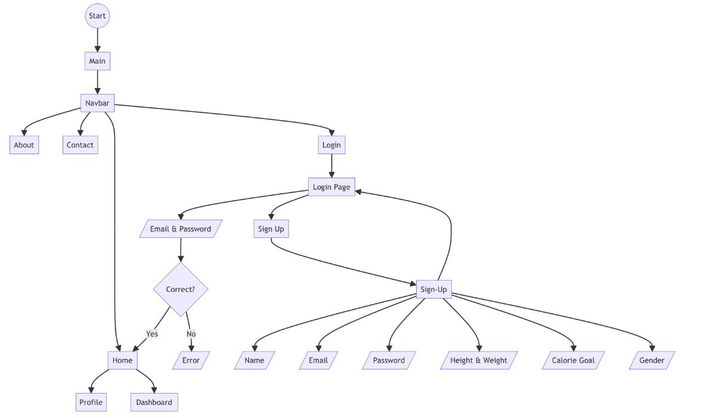

# FitNow!
*"Taking control of your fitness journey has never been this easy or fun!"*
***

## What is FitNow?
FitNow is a website that helps people keep track of their fitness. It's like a digital 
diary for your workouts and health.
***
## Cool Things You Can Do with FitNow:
• Set Up Your Profile: When you start, you tell the website about your weight, height, and how many calories you want to burn every day.

• Your Own Fitness Board: On your dashboard page, you can tell FitNow what exercises you did and for how long. As you add your workouts, a bar will fill up showing you how much you've done for the day.

• See Your Progress: You'll have a bar that fills up when you get closer to your daily goal. It's fun to see it get full!

• Check Your Health Score: The website can also tell you your BMI, which is a number that shows if your weight is suitable for your height.
***
## Why FitNow is Awesome:
1. Be the Boss of Your Fitness: FitNow lets you see how you're doing, so you can decide what to do next.
   
2. Stay Motivated: Watching the progress bar fill up makes you want to do more exercises and reach your goal every day.
   
3. Learn About Your Body: The BMI number helps you understand if you're in a healthy range for your height.
***
## To Wrap Up:
FitNow is a fun and easy way to watch and plan your workouts. It helps you stay on track and reach your fitness goals. Give it a try and get moving!
***
## User Interaction Flowchart: Complete User Journey:

***
## Underlying Technologies:

**Front-end:**
- **HTML**: Markup language for creating web pages.
- **CSS**: Stylesheet language used for describing the look and formatting of a document written in HTML.
- **JavaScript**: High-level, versatile scripting language that enables interactive web pages.

**Back-end:**
- **Node.js**: JavaScript runtime built on Chrome's V8 JavaScript engine.
- **Express**: Minimal and flexible Node.js web application framework.
- **Express-session**: Middleware for Express to manage user sessions.
- **EJS**: Embedded JavaScript templates, a templating engine used to generate HTML markup with plain JavaScript.

**Database:**
- **MongoDB**: NoSQL database program, using JSON-like documents with optional schemas.
***
## Project Screenshots:

_Description for the first screenshot._

_Description for the second screenshot._
***
## How to Run the Website:
### 1. Start the Server:
Navigate to the project directory in your terminal and run the following command:
"npm run start"
### 2. Access the Website:
Open your preferred web browser and enter the following URL:
http://localhost:3000
### 3.Once done, the website should be up and running on your local machine.
***
## 🌟 Meet the Makers 🌟:
- 👩‍💻 [Ealan Alaredih](https://github.com/ealan-01)
- 👨‍💻 [Nouf Almahmoud](https://github.com/Nouf_SM)
- 👨‍💻 [Lama Alturki](https://github.com/Lamaturki1)
- 👨‍💻 [Bayan Alzahrani](https://github.com/BayanAli2)

  

